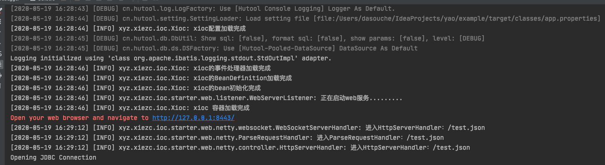

# Yao 总框架


##  使用示例
> 说明除了下面示例的方式， 还可以使用FactoryBean接口和@Bean注解方法的方式将bean放入容器中

### 导入maven包
```xml
<!-- 依赖注入的核心包， 提供基本的依赖注入功能  -->
<dependency>
    <groupId>xyz.xiezc</groupId>
    <artifactId>xioc</artifactId>
    <version>1.0</version>
</dependency>
```

```xml
<!--  整合mybatis的包  -->
<dependency>
    <groupId>xyz.xiezc</groupId>
    <artifactId>xorm</artifactId>
    <version>1.0</version>
</dependency>
```
```xml
<!--  数据源链接池  -->
<dependency>
    <groupId>com.alibaba</groupId>
    <artifactId>druid</artifactId>
    <version>${druid.version}</version>
</dependency>
```

```xml
<!--  整合netty的包, 提供了基本的http能力和websocket支持  -->
<dependency>
    <groupId>xyz.xiezc</groupId>
    <artifactId>xweb</artifactId>
    <version>1.0</version>
</dependency>

```

### 定义一个启动类
```java

import xyz.xiezc.ioc.Xioc;
import xyz.xiezc.ioc.annotation.Configuration;
import xyz.xiezc.ioc.starter.orm.annotation.MapperScan;

@MapperScan("xyz.xiezc.example.web")
@Configuration
public class ExampleApplication {

    public static void main(String[] args) {
        Xioc.run(ExampleApplication.class);
    }
}
```
###  定义一个Controller放入容器中
```java
import cn.hutool.json.JSONUtil;
import xyz.xiezc.ioc.annotation.Inject;
import xyz.xiezc.ioc.starter.orm.common.example.Example;
import xyz.xiezc.ioc.starter.web.annotation.Controller;
import xyz.xiezc.ioc.starter.web.annotation.GetMapping;
import xyz.xiezc.ioc.starter.web.entity.WebContext;

import java.util.List;
import java.util.Map;

@Controller("/")
public class TestController {

    @Inject
    AlbumMapper albumMapper;

    @GetMapping("/test.json")
    public String get(String param) {
        WebContext webContext = WebContext.get();
        //
        Example build = Example.of(Album.class)
                .andEqualTo(Album::getId,3537) //支持类似mybatis-plus的lambda的使用方式
                .build();
        List<Album> albums = albumMapper.selectByExample(build);
        //获取session信息
        Map<String, Object> session = webContext.getSession();
        session.put("param", param);
        
        return JSONUtil.toJsonStr( albums);
    }
}
```
### 定义一个实体类
```java

import lombok.Data;
import xyz.xiezc.ioc.starter.orm.annotation.Column;
import xyz.xiezc.ioc.starter.orm.annotation.Id;
import xyz.xiezc.ioc.starter.orm.annotation.Table;

import java.io.Serializable;
import java.time.LocalDateTime;

@Data
@Table("t_album")
public class Album implements Serializable {
    @Id
    Integer id;
    @Column
    String title;
    @Column
    String publishTime;
    @Column
    String type;
    @Column
    LocalDateTime createTime;
    @Column
    Integer coverId;
    @Column
    Integer see;
}
```
### 定义一个Mapper接口
```java
import xyz.xiezc.ioc.starter.orm.common.BaseMapper;

public interface AlbumMapper extends BaseMapper<Album> {
}
```
### 定义一个websocket的controller
```java

import io.netty.handler.codec.http.websocketx.BinaryWebSocketFrame;
import io.netty.handler.codec.http.websocketx.TextWebSocketFrame;
import io.netty.handler.codec.http.websocketx.WebSocketFrame;
import xyz.xiezc.ioc.starter.web.annotation.WebSockerController;
import xyz.xiezc.ioc.starter.web.netty.websocket.WebSocketFrameHandler;

@WebSockerController("/websocket")
public class WebSocketHandler implements WebSocketFrameHandler {

    @Override
    public WebSocketFrame handleTextWebSocketFrame(TextWebSocketFrame textWebSocketFrame) {
        String text = textWebSocketFrame.text();
        TextWebSocketFrame textWebSocketFrame1 = new TextWebSocketFrame("resp:" + text);
        return textWebSocketFrame1;
    }

    @Override
    public WebSocketFrame handleBinaryWebSocketFrame(BinaryWebSocketFrame binaryWebSocketFrame) {
        return null;
    }
}

```
### 配置文件
```properties

## 基本配置信息
# JDBC URL，根据不同的数据库，使用相应的JDBC连接字符串
url = jdbc:mysql://127.0.0.1:8306/daily
# 用户名，此处也可以使用 user 代替
username = root
# 密码，此处也可以使用 pass 代替
password = 123456
# JDBC驱动名，可选（Hutool会自动识别）
driver = com.mysql.cj.jdbc.Driver

## 是否启用ssl
xweb.server.ssl.enable = false
### web服务的端口
xweb.server.port=8443
### 静态文件的目录
xweb.static.path=/static

```





## Xioc 小型的依赖注入框架， 
### 目前支持的注解详解
* @Component 被注解的类放入容器成为bean，可以注解类和方法。 
* @Configuration 被注解的类放入容器成为bean, 只能注解类。
* @Inject 注解字段，是的字段从容器中注入bean。 
* @Bean 方法注解， 只能配合@Configuration注解通过方法来生产bean
* @BeanScan 类注解， 只能配合@Configuration一起使用，用来标注框架扫描的包路径
* @Init 方法注解，  被注解的方法在所在bean初始化完成后调用， 方法必须无参 
* @Value 字段注解。  将配置中的内容注入到字段中， 类型转换参照Hutool的类型转换工具。 
* @EventListener 类注解， 被注解的方类必须有无参构造方法，且实现ApplicationListener接口， 注解中必须设置处理的时间名称。

### 目前支持功能列表如下
* 所有的bean都是单例模式
* 基本的扫描注入类，  
* 支持方法注入bean
* 支持注入配置，配置文件使用Hutool的setting
* 支持类似springboot的starter一样的导入包引入对应功能的方法
> 需要导入的starter包必须在xyz.xiezc.ioc.starter包下放上一个@Configuration注解的类。 并且可以配合@BeanScan一起使用
* 支持bean初始化后调用的init方法
* 支持基本的事件处理器
* 支持配置注入

### 缺陷待完善
* AOP功能需要在被切的类上面增加注解， 但是AOP的意义就在于不用修改被切类从而达到切面的目的


## xweb 整合netty支持web的框架
### 支持的注解
* @Controller  参考SpringMvc
* @GetMapping  参考SpringMvc
* @PostMapping  参考SpringMvc
* @RequestBody  参考SpringMvc
* @WebSockerController  被注解的类必须实现WebSocketFrameHandler接口， 从而来实现websocket. 这个注解的value值就是websocket的连接的url

### 说明
* 默认静态文件目录是 `classPath：static/` ，在这个目录下面的文件会作为静态文件。可以在配置文件中指定 `xweb.static.path` 作为静态文件。
* 请求路径只有在controller中找不到后才会进入静态文件目录下查找。
* GET和POST请求只返回application/json格式的内容，不返回其他类型。这样已经够用了， 现在几乎都是前后端分离的项目。

### 不完美的地方
* 只支持GET和Post请求
* Post请求只默认提供支持的ContentType类型只有 "application/json" ，"multipart/form-data" ， 
"application/x-www-form-urlencoded"和从url中获取参数的Default几种类型，但是提供了扩展接口。 
只要实现HttpMessageConverter接口，并将实现类放入容器中，就可以了。

### 支持的配置文件的配置
```shell script

## 是否启用ssl
xweb.server.ssl.enable = false
### web服务的端口
xweb.server.port=8443
### 静态文件的目录
xweb.static.path=/static

```


## XORM 整合mybatis方便查询的项目 
### 支持的注解
* @Column 标注在实体类中， 可以通过value 指定数据库字段的名称。 
* @Id 标注在实体类中， 可以通过value 指定数据库字段的名称。 
* @MapperScan 一定要标注在启动类中， value指定项目中的mybatis的mapper接口的地址
* @Table 标注在实体类上， 标识这个类对应一个数据库表

### 支持的配置文件的配置 
* mybatis.configLocation 指定自定义的mybatis的配置文件地址
* mybatis.mapperLocations 指定自定义的mapper.xml文件的路径
* mybatis.typeAliasesPackage 参考mybatis-spring
* mybatis.typeHandlersPackage 参考mybatis-spring

### 数据源的配置
> 本框架中数据源的使用是完全使用hutool中的数据源的方式

```shell script

## 基本配置信息
# JDBC URL，根据不同的数据库，使用相应的JDBC连接字符串
url = jdbc:mysql://127.0.0.1:8306/daily
# 用户名，此处也可以使用 user 代替
username = root
# 密码，此处也可以使用 pass 代替
password = 123456
# JDBC驱动名，可选（Hutool会自动识别）
driver = com.mysql.cj.jdbc.Driver

```
#### 支持如下的数据源
1. HikariCP
2. Druid
3. Tomcat
4. Dbcp
5. C3p0
  
本框架句自动识别数据源以及自动注入配置文件中的连接池配置（包括数据库连接配置），如果引入了多种数据源的jar包。 本框架会按照上面的顺序来检测引入数据源包，检测到则会自动构建数据源。如果没有检测到数据源包， 就会使用内置的简单数据源(性能问题， 不推荐线上使用)

以druid为例， 我们看下如何使用

1. 先引入druid的包
```xml
<dependency>
    <groupId>com.alibaba</groupId>
    <artifactId>druid</artifactId>
    <version>${druid.version}</version>
</dependency>
```

2. 再在配置文件中增加如下
```properties

#----------------------------------------------------------------------------------------------------------------
## 基本配置信息
# JDBC URL，根据不同的数据库，使用相应的JDBC连接字符串
url = jdbc:mysql://<host>:<port>/<database_name>
# 用户名，此处也可以使用 user 代替
username = 用户名
# 密码，此处也可以使用 pass 代替
password = 密码
# JDBC驱动名，可选（Hutool会自动识别）
driver = com.mysql.jdbc.Driver
# 是否在日志中显示执行的SQL
showSql = true
# 是否格式化显示的SQL
formatSql = true


#----------------------------------------------------------------------------------------------------------------
## 连接池配置项

## ---------------------------------------------------- Druid
# 初始化时建立物理连接的个数。初始化发生在显示调用init方法，或者第一次getConnection时
initialSize = 0
# 最大连接池数量
maxActive = 8
# 最小连接池数量
minIdle = 0
# 获取连接时最大等待时间，单位毫秒。配置了maxWait之后， 缺省启用公平锁，并发效率会有所下降， 如果需要可以通过配置useUnfairLock属性为true使用非公平锁。
maxWait = 0
# 是否缓存preparedStatement，也就是PSCache。 PSCache对支持游标的数据库性能提升巨大，比如说oracle。 在mysql5.5以下的版本中没有PSCache功能，建议关闭掉。作者在5.5版本中使用PSCache，通过监控界面发现PSCache有缓存命中率记录， 该应该是支持PSCache。
poolPreparedStatements = false
# 要启用PSCache，必须配置大于0，当大于0时， poolPreparedStatements自动触发修改为true。 在Druid中，不会存在Oracle下PSCache占用内存过多的问题， 可以把这个数值配置大一些，比如说100
maxOpenPreparedStatements = -1
# 用来检测连接是否有效的sql，要求是一个查询语句。 如果validationQuery为null，testOnBorrow、testOnReturn、 testWhileIdle都不会其作用。
validationQuery = SELECT 1
# 申请连接时执行validationQuery检测连接是否有效，做了这个配置会降低性能。
testOnBorrow = true
# 归还连接时执行validationQuery检测连接是否有效，做了这个配置会降低性能
testOnReturn = false
# 建议配置为true，不影响性能，并且保证安全性。 申请连接的时候检测，如果空闲时间大于 timeBetweenEvictionRunsMillis，执行validationQuery检测连接是否有效。
testWhileIdle = false
# 有两个含义： 1) Destroy线程会检测连接的间隔时间 2) testWhileIdle的判断依据，详细看testWhileIdle属性的说明
timeBetweenEvictionRunsMillis = 60000
# 物理连接初始化的时候执行的sql
connectionInitSqls = SELECT 1
# 属性类型是字符串，通过别名的方式配置扩展插件， 常用的插件有： 监控统计用的filter:stat  日志用的filter:log4j 防御sql注入的filter:wall
filters = stat
# 类型是List<com.alibaba.druid.filter.Filter>， 如果同时配置了filters和proxyFilters， 是组合关系，并非替换关系
proxyFilters = 
```

3. 开始你的表演， 写你最熟悉的mapper 代码


### 说明  
* 目前没有实现事务的功能， 还不支持事务。
* Mapper接口必须实现xyz.xiezc.ioc.starter.orm.common.BaseMapper接口，BaseMapper接口提供了基本的方便的查询的方法，十分方便。
* 可以不用谢mapper.xml文件。 只有到BaseMapper接口不满足需求的时候可以加上xml文件，
mapper.xml文件的默认路径是classPath:mapper/ 。 也可以通过配置文件mybatis.mapperLocations来指定

### 本框架待改进的地方
* 不要引入mysql的jdbc链接包。 因为用户不一定是使用的mysql。
* 实现事务的管理功能， 可以参考spring的事务管理实现 


## 参考项目
[hutool](https://github.com/looly/hutool)
> hutool 这真的是一个很好的工具包项目， 全面而有强大， 依赖少。 本框架大量依赖这个工具包

[blade](https://github.com/lets-blade/blade)
> blade是和本项目类似的框架。我的整合netty中的代码参考这个项目很多

**spring**

**netty**


